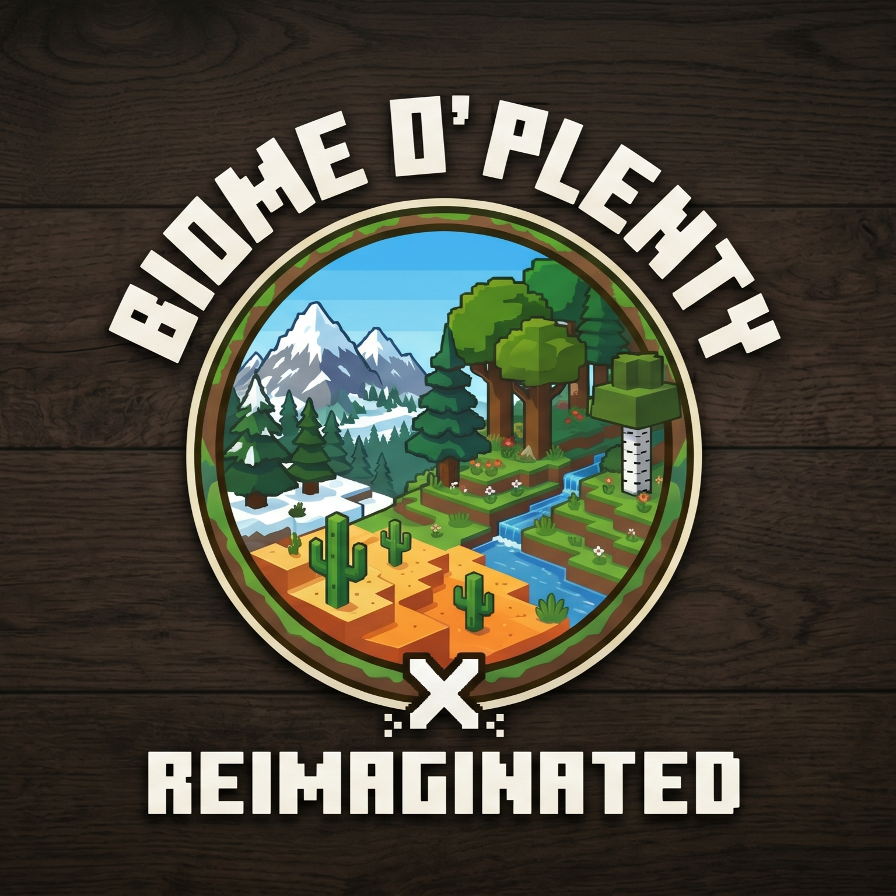

**A compatibility resource pack that integrates the Biomes O' Plenty colormaps with the Reimaginated colormaps.**

---

## 📦 About

This pack was created to bring visual harmony between the expanded terrain generation of **Biomes O' Plenty** and the vibrant, updated graphics of **Reimaginated**.

**Note:** Currently, this pack is in its early stages and **only adjusts the colors of some leaves**. The project will continue to be updated over time.

- **Author:** Kaokod
- **Current Version:** 0.1
- **Pack Format:** 34 (Minecraft 1.21)

## ⚠️ Requirements

For this compatibility pack to function correctly, you **must** have the following mod installed:
- **[Polytone](https://modrinth.com/mod/polytone)** (Required for custom colormaps and advanced texture features)

## ⚙️ Installation

1. Ensure you have the **Polytone** mod installed in your mods folder.
2. Download this resource pack and place it in your `resourcepacks` folder
3. In-game, navigate to **Options > Resource Packs** and enable it.
4. **CRITICAL:** The load order of your active packs makes a huge difference! Please configure it exactly as shown in the image below, keeping this compatibility pack *above* the main Reimaginated pack:

## 🐛 Feedback, Issues & Suggestions

Did you find any color inconsistencies or would like to request integration with another mod (like Terralith, for example)?

Feel free to **[open an Issue on our GitHub repository](https://github.com/twk0d/Biome-O-Plenty-x-Reimaginated/issues)**! All feedback is welcome to help improve the pack.

## 📝 License

See the `LICENSE` file included in the project for more details on usage rights.
